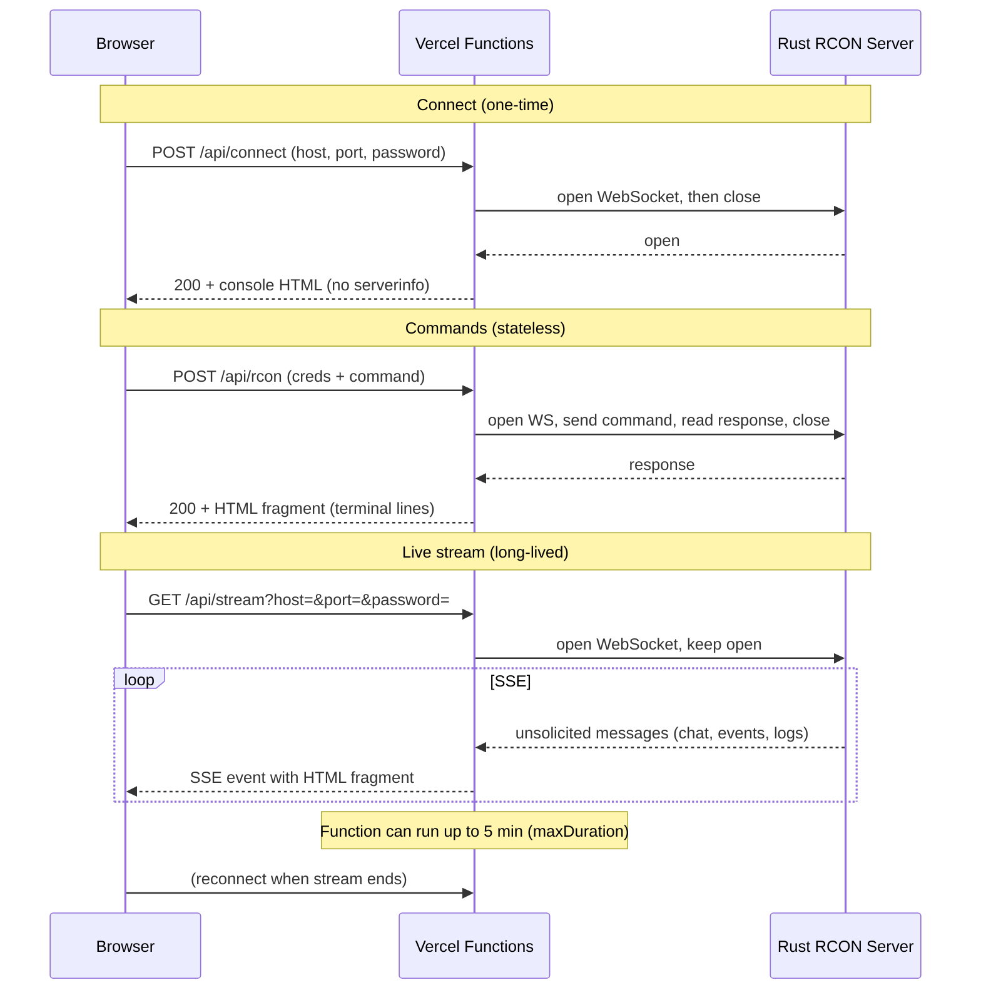

# rcon-htmx demo

Minimalist, almost full-screen RCON console for **Rust** servers. Users enter host, port, and RCON password in the UI (no env vars). Deployable to **Vercel** with no custom server.

## How it works on Vercel

Vercel is serverless: no long-lived process and no WebSocket endpoint for the browser. This demo works by splitting traffic into two paths:



- **POST /api/connect** — Verifies credentials by opening the Rust RCON WebSocket once and closing it. Returns the console UI (no `serverinfo` run).
- **POST /api/rcon** — Stateless: each request opens a new WebSocket, sends the command, returns the response as HTML, then closes. Credentials and command come from the form (hidden fields + input).
- **GET /api/stream** — Long-lived serverless function that holds a single WebSocket to the Rust server and streams all unsolicited messages (logs, chat, events) to the browser as **Server-Sent Events**. The frontend uses htmx’s SSE extension to append each event into the console. When the function eventually times out (or the WS closes), htmx reconnects to `/api/stream` so the stream effectively continues.

The browser never talks WebSocket to your backend; it uses HTTPS only (POST for commands, GET for the SSE stream). The WebSocket to the Rust server lives only inside Vercel’s Node runtime.

## Run locally

```bash
npm install
npm run dev
```

Open `http://localhost:3000`, enter your Rust server’s host, port, and RCON password, then connect. `dev-server.js` mimics Vercel’s routing (API routes + static from `public/`).

## Deploy to Vercel

```bash
vercel --prod
```

- **Build** — Vercel runs `npm run build`, which copies htmx and htmx-ext-sse from `node_modules` into `public/vendor/` so the app can load `/vendor/htmx.min.js` and `/vendor/sse.js` without a CDN.
- **No env vars** — RCON host, port, and password are supplied by the user in the UI.
- **Stream duration** — `vercel.json` sets `maxDuration: 300` (5 minutes) for `api/stream.js`. Keep **Fluid Compute** enabled (Project → Settings → Functions) so the stream can run that long; with it disabled, the Hobby plan limits functions to 10s default / 60s max and the stream would close too soon.
- **Rust server** — The deployed app connects outbound to your Rust RCON WebSocket. Ensure the server allows connections from the internet (firewall, RCON port, etc.) when you connect from the Vercel URL.

## Key files

| Path | Role |
|------|------|
| `public/index.html` | Single-page UI: connect form, then console with SSE and command form. Loads htmx and htmx-ext-sse from `/vendor/`. |
| `api/connect.js` | POST: test credentials via `testConnection()`, return console HTML or connect form with error. |
| `api/rcon.js` | POST: run one RCON command via `execRcon()`, return terminal-line HTML fragment. |
| `api/stream.js` | GET: open WebSocket to Rust RCON, stream unsolicited messages as SSE with terminal-line HTML. Sends a first byte and heartbeats so the request isn’t closed as idle. |
| `api/disconnect.js` | POST: return the connect form (resets UI). |
| `api/_lib/rcon.js` | `testConnection()`, `execRcon()` — Node `ws` client with `http.Agent` and `Host` header for Vercel’s outbound proxy. |
| `api/_lib/html.js` | Shared HTML fragments: connect form, console view, terminal lines, `lineClass()` for colorization. |
| `vercel.json` | `buildCommand: "npm run build"`, `functions["api/stream.js"].maxDuration: 300`. |
| `scripts/copy-vendor.js` | Copies `node_modules/htmx.org/dist/htmx.min.js` and `node_modules/htmx-ext-sse/sse.js` to `public/vendor/`. |

The app is **htmx-only** on the client: no custom JavaScript, only htmx attributes and the SSE extension.
